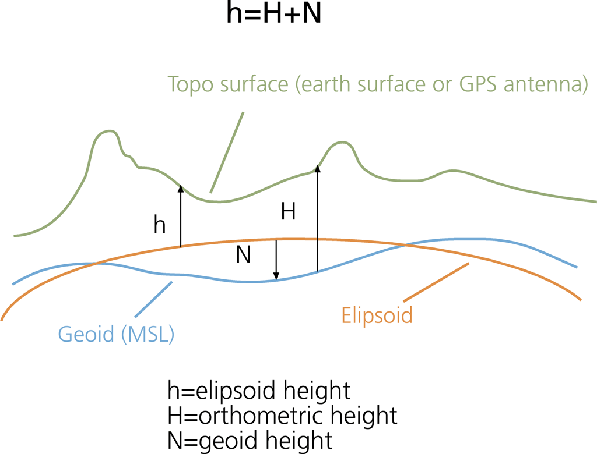

# Geodesics
This repository is all about the Geodesic sciences and projects related therein.

## What is Geodesy

What exactly is Geodesy? Well, below this is what Wikipedia defines Geodesy as.

> "Geodesy is the Earth science of accurately measuring and understanding Earth's geometric shape, orientation in space and gravitational field. The field also incorporates studies of how these properties change over time and equivalent measurements for other planets."

## Models of the Earth
What shape is the earth exactly? This is an interesting question which although seemly one would think theres an easy answer to it has perplexed scientists. Truth is there is no definite platonic solid which can fit the model for the earth with its surface included its really quiet rough like a rock hence the name geode. Nevertheless scientists still try to approximate the shape of the earth with using networks of survey markers placed around the earth. Some of these models include both the North American Datum of 1927 (NAD27) and World Geodetic System (WGS84)  both which reference the earth as an approximated ellisoid form. 

## Surveying 

## Remote Sensing
*[Youtube playlist on Remote Sensing](https://www.youtube.com/playlist?list=PL1Se2xIuNxEoF1kY6fONj9U0oycsERbmj)*. 
One field of study which is strongly linked with geodesy is remote sensing which deals with both passive and active data measurements of light being bounced off the earth. In the case of synthetic aperature radar or LiDAR these measurements can be used to figure out what the vertical datums are on earth as well as some other key features. Of course the relevance and applications of remote sensing extend beyond this one way in which they're linked this is just an example. 

